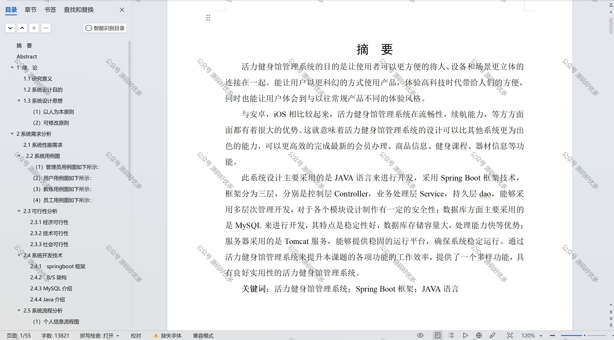

 
## 查看主页获取源码

> **作者介绍**： **✌**全网粉丝10W+本平台特邀作者、博客专家、CSDN新星计划导师、java领域优质创作者,博客之星、掘金/华为云/阿里云/InfoQ等平台优质作者、专注于项目实战 **✌**

  

### 一、作品包含

源码+数据库+设计文档万字+PPT+全套环境和工具资源+部署教程

### 二、项目技术

前端技术：Html、Css、Js、Vue、Element-ui

数据库：MySQL

后端技术：Java、Spring Boot、MyBatis

  

### 三、运行环境

开发工具：IDEA/eclipse

数据库：MySQL5.7

数据库管理工具：Navicat10以上版本

环境配置软件： JDK1.8+Maven3.6.3

前端Nodejs：14

### 四、项目介绍
项目编号：springbootA103

活力健身馆管理系统是为了适应现代健身行业的发展需求，提高健身馆运营效率和服务质量而设计的一套综合管理软件。在健身已成为越来越多人的生活方式的背景下，健身馆需要一个高效、便捷的管理工具。

管理员功能，系统首页包括个人中心、员工管理、教练管理、用户管理、会员类型管理、会员办理管理、商品信息管理、健身课程管理、器材信息管理、失物招领管理、报课记录管理、退课记录管理、认领记录管理、员工工资管理、教练工资管理、留言反馈和系统管理等功能模块。

教练功能，系统首页、个人中心、健身课程管理、报课记录管理、退课记录管理和教练工资管理。

员工功能，系统首页、个人中心、会员类型管理、会员办理管理、商品信息管理、健身课程管理、器材信息管理、失物招领管理、认领记录管理、员工工资管理、订单管理。

用户功能，系统首页、个人中心、会员办理管理、报课记录管理、退课记录管理和认领记录管理。

### 五、运行截图

  
